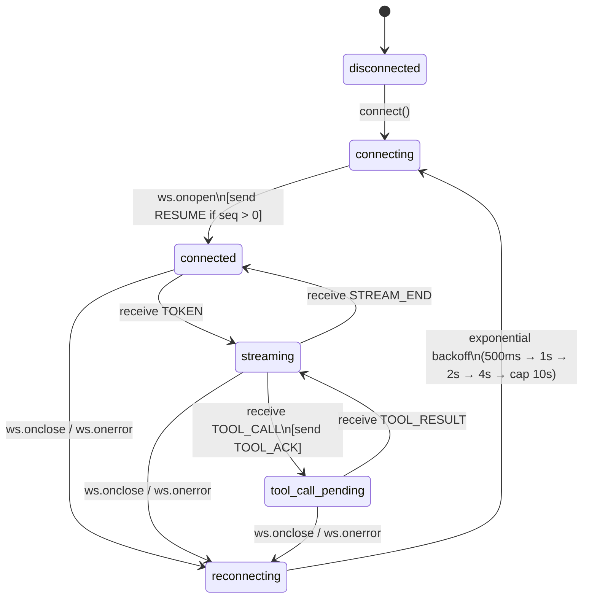

# Agent Console — Full Stack AI Engineer Assignment

> **Author:** Shaik Firdos

---

## Architectural Approach

This application is built on a **three-layer separation**: a custom `SequenceBuffer` class handles all WebSocket protocol concerns (ordering, deduplication, RESUME tracking) in isolation; a global Zustand store acts as the single source of truth for all rendered state; and React components are pure projections of that store with no direct socket knowledge. All incoming packets are held by the buffer until they can be yielded in strict `seq` order, meaning the render layer is entirely shielded from the network's chaos. The `parts: MessagePart[]` model inside each `ChatMessage` is a flat state-machine array that allows text and tool cards to interleave without reflow, because we only ever append or update-in-place — never splice or reorder.

---

## WebSocket State Machine



**Key protocol rules enforced at each transition:**
- `connected → streaming`: Every inbound packet is first passed to `SequenceBuffer.insert()`. Only packets that are in sequence are processed. Out-of-order packets wait in the buffer's internal `Map`.
- `connected (on open)`: The **first** message sent is always `RESUME { last_seq }` if `currentSeq > 0`. This happens before any buffered events are processed.
- `streaming → tool_call_pending`: A `TOOL_ACK` is sent immediately (< 2s) upon receiving `TOOL_CALL`. The stream state is `'tool_pending'` until `TOOL_RESULT` lands.
- Any state `→ reconnecting`: Zustand state and `SequenceBuffer` are preserved in-memory (React refs). Only the `WebSocket` object is replaced.

---

## Running the App

### Prerequisites
- Docker Desktop installed and running
- Node.js 20+
- npm

### 1. Start the Agent Server

```bash
# Build the backend image (one-time)
docker build -t agent-server ./agent-server

# Normal mode
docker run -p 4747:4747 agent-server

# Chaos mode (for testing resilience)
docker run -p 4747:4747 agent-server --mode chaos
```

### 2. Run the Frontend

```bash
# Install dependencies
npm install

# Development server
npm run dev
```

Open [http://localhost:3000](http://localhost:3000) in your browser.

### 3. Production Build

```bash
npm run build
npm start
```

### 4. End-to-End Tests

```bash
npm run test:e2e
```

---

## Screenshots (Normal Mode)

### (a) Streamed Response with Tool Call

The agent streams tokens incrementally. When a `TOOL_CALL` arrives mid-stream, the text freezes in place and a tool call card appears below it showing the tool name, arguments, and a loading spinner. When `TOOL_RESULT` arrives, the card updates and streaming resumes.

> *See the app running at `http://localhost:3000` with the agent-server active.*

### (b) Trace Timeline

The left-hand panel shows every protocol event in real time — `TOKEN` events are batched into grouped rows ("Streamed N tokens"), `TOOL_CALL`/`TOOL_RESULT` events are visually indented together by `call_id`, and `PING`/`PONG`/`CONTEXT_SNAPSHOT`/`ERROR` events each appear with colour-coded type badges. The filter bar and search box allow filtering by event type or payload content.

### (c) Context Inspector with Diff

The right-hand panel renders the `CONTEXT_SNAPSHOT` payload as an interactive collapsible JSON tree. When a second snapshot arrives for the same `context_id`, added keys are highlighted in green and removed keys are struck through in red. The history scrubber (range slider) allows stepping backward and forward through every snapshot version.

---

## Chaos Mode Screen Recording

The screen recording demonstrates the following scenarios in **chaos mode**:

1. **Connection drop mid-stream** — The agent drops the WebSocket during token streaming. The app reconnects silently, sends `RESUME`, and the response continues seamlessly from where it was interrupted.
2. **Out-of-order messages** — Tokens arrive with shuffled `seq` values. The `SequenceBuffer` holds them and yields them in correct order before they reach the render layer.
3. **Rapid tool calls** — Two `TOOL_CALL` events fire in quick succession. Both cards appear, both results land, and streaming resumes without duplication or overwrite.
4. **Oversized context snapshot** — A 500KB+ `CONTEXT_SNAPSHOT` arrives. The context inspector's `MAX_KEYS_TO_RENDER` pagination keeps the tab responsive and non-blocking.
5. **Corrupt heartbeat** — A `PING` with an empty `challenge` field arrives. The client handles it without crashing by defaulting to `echo: ""` in the `PONG` response.

📹 **Recording file included in repo:** [`Assignment.mp4`](./Assignment.mp4)

---

## Project Structure

```
src/
├── app/                        # Next.js App Router entry
├── components/
│   ├── chat/
│   │   ├── ChatPanel.tsx       # Input, message list, send handler
│   │   ├── MessageBubble.tsx   # Renders a single ChatMessage's parts[]
│   │   └── ToolCallCard.tsx    # Tool call + result card with loading state
│   ├── timeline/
│   │   ├── TraceTimeline.tsx   # Scrollable event list with filter/search
│   │   └── EventRow.tsx        # Single event row with expand/highlight
│   └── inspector/
│       └── ContextInspector.tsx # JSON diff tree + history scrubber
└── lib/
    ├── network/
    │   ├── SequenceBuffer.ts   # Map-based seq ordering & deduplication
    │   └── useAgentSocket.ts   # WebSocket hook: connect, RESUME, PING/PONG
    ├── store/
    │   └── useChatStore.ts     # Zustand store: all app state
    └── types/
        └── protocol.ts         # TypeScript types for all WS message shapes
automation/                     # Playwright E2E test suite
agent-server/                   # Provided Docker backend (unmodified)
```

---

## State Management Rationale

**Zustand** was chosen over Redux or `useState` for two reasons:

1. **Surgical updates**: Zustand's `set()` function accepts a partial state updater. Each action (`appendToken`, `setToolResult`, `addTraceEvent`) touches only the slice of state it owns. This prevents the full component tree from re-rendering on every token, which is critical at 30+ events/second.
2. **No boilerplate**: The WebSocket hook and store are separate files with no coupling infrastructure. The socket pushes events; the store holds rendered state. There is no action/reducer/dispatch ceremony to maintain.

---

## Key Dependencies

| Package | Version | Purpose |
|---|---|---|
| `next` | 14.2.35 | App Router framework |
| `react` | 18 | UI rendering |
| `zustand` | 5.0.14 | Global state management |
| `@playwright/test` | 1.61.1 | End-to-end test suite |
| `typescript` | 5 | Strict type safety |
| `tailwindcss` | 3.4.1 | Utility-first CSS |
